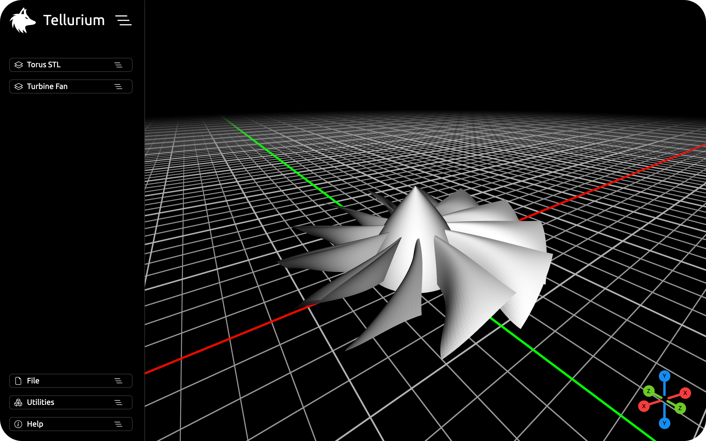
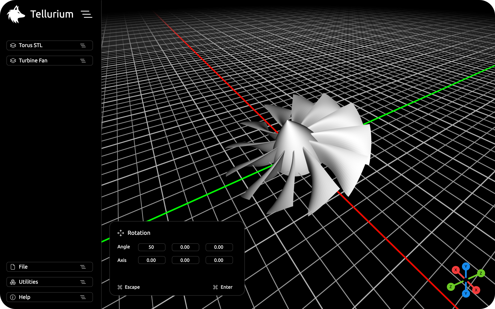

# WEBGL STL Viewer
A tiny STL file viewer with powerful, yet limited capability. It can be used as a STL file editor.
This project has it's origins as an advanced NURB modeler, however I decided to branch out a part of the program and created this STL file viewer.

Various things that can be done are...
* Import ASCII and binary STL files, export them separately or together as a binary STL file.
* Rotate, scale and transform imported STL files, indepently or together.
* Choose which mesh gets displayed and which will not, optimal for an efficient viewing experience.

You can view the [live demo](https://798.pages.dev/s/viewer) over at my personal site.

# Usage
The STL file viewer at it's core is an easy program to audit multiple STL files at the same time. The key functionality can be accessed through the canvas UI, or with the keybinds below.

Various keybinds that can be used are......

- `WASD` To move around the scene.
- `R` To rotate the current selection around the specified axis.
- `G` To move the current selection.
- `T` To scale the current selection to the desired size.
- `P` If you want to import either an ASCII or binary STL file.
- `Y` To open the mesh option menu.
- `H` To hide or unhide the selected mesh.
- `X` To remove one or multiple meshes from the scene.

It can be run locally by navigating to the project directory and running the following command, then use a your preferred browser to load the page.
```bash
python -m SimpleHTTPServer // Access at localhost:8000
```

# Images
<p align="center">
  
  &nbsp; &nbsp; &nbsp; &nbsp;
  
</p>

# License & Attribution
This STL file viewer is provided under the MIT attribution license. 

It uses various vector images from the Bootstrap SVG collection.\
It also uses a modified version of the [THREE.InfiniteGridHelper](https://github.com/Fyrestar/THREE.InfiniteGridHelper) by Fyrestar.
