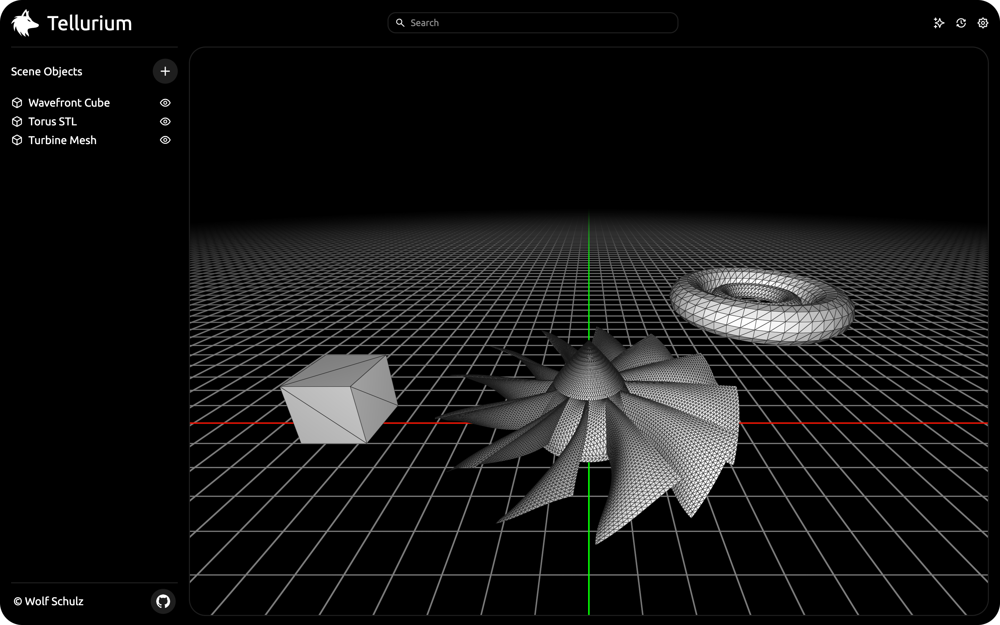
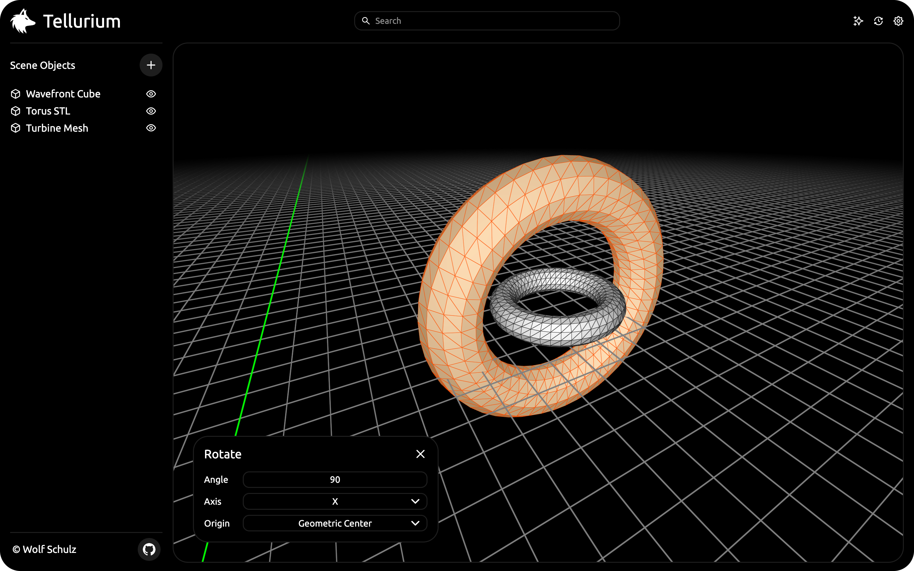

# Tellurium - 3D Model Manipulator
A tiny 3D viewer with powerful, yet limited capability. It can be used as a simple 3D model manipulator.
This project has it's origins as an advanced NURB modeler, however I decided to branch out a part of the program and created this project.

Supported file types: STL, OBJ;

Various things that it can do are...
* Import OBJ and STL (ASCII / Binary) files, export them separately or together as a binary STL file.
* Rotate, scale and transform imported 3D models, indepently or together.
* Choose which mesh gets displayed and which will not, optimal for an efficient viewing experience.
* Smoothen a mesh using the linear Butterfly subdivision scheme.

You can view the [live demo](https://798.pages.dev/s/viewer) over at my personal site.

## Usage
The 3D manipulator is at it's core an easy to use program to audit multiple 3D files at the same time. The key functionality can be accessed through the UI, or with the keybinds below. It supports some minor modeling workloads and can be also be used as a viewer.

Some of the keybinds that can be used are...
- `WASD` To move around the scene.
- `R` To rotate the current selection around the specified axis.
- `G` To move the current selection.
- `T` To scale the current selection to the desired size.
- `P` If you want to import either an ASCII or binary STL file.
- `L` To retrieve all vertices linked to the active selection.
- `X` To remove selected vertices from the scene.

It can be run locally by navigating to the project directory and running the following command, then use a your preferred browser to load the page.
```bash
python3 -m http.server // Access at localhost:8000
```

## Images
<p align="center">
  
  &nbsp; &nbsp; &nbsp; &nbsp;
  
</p>

## The Future
* Auto compute sharp edges for SubD (same as autosmooth blender with angle 30d for example);

## License & Attribution
This 3D manipulator is open-source and provided under the MIT attribution license.

-- Subd butterfly

SVG icon collection "Ui Oval Interface Icons" (Public Domain);
Made By Wolf Pieter Schulz.
